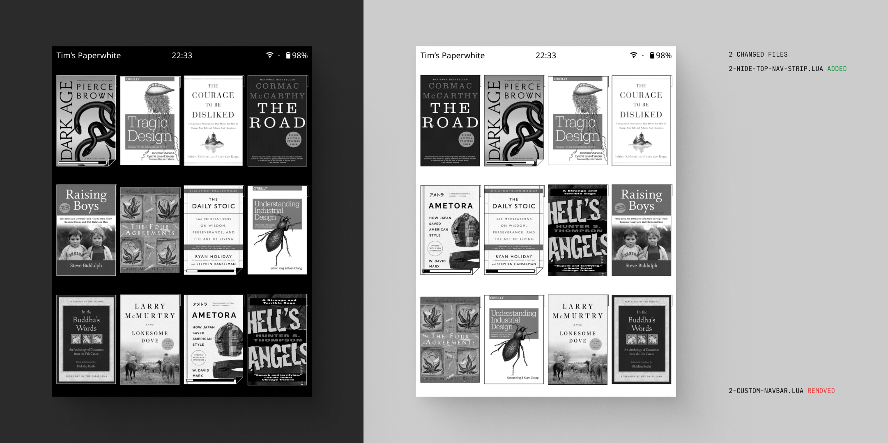

# KOReader Patches

Forked from [qewer33's KOReader Patches](https://github.com/qewer33/koreader-patches). The original repo has a lot more going on, including a custom navbar and extra configurability. This fork strips things back. The goal here is a minimal, distraction-free file browser for a clean KOreader experience.



## Installation

Drop the `.lua` files into your `koreader/patches/` directory. Place the icons from the `icons/` folder into your KOReader `icons/` directory.

## Patches

### 2-custom-titlebar.lua

Replaces the default "KOReader" title with a status bar showing device name, time, battery, Wi-Fi, and other indicators. Fully configurable under **File Browser > Titlebar settings**.

### 2-quick-settings.lua

Adds a Quick Settings tab to the top menu with quick toggles (Wi-Fi, night mode, rotate, restart, etc.) and frontlight/warmth sliders. Configurable under **Settings > Quick settings**.

### 2-hide-pagination.lua

Removes the pagination bar from the file browser, history, favorites, and collections views. The grid stretches to fill the freed space. Swipe navigation still works.

### 2-hide-top-nav-strip.lua

Hides the subtitle row (home icon, folder path, plus icon) from the titlebar, reclaiming more vertical space for the cover grid (my addition).

## Deploy Script

`deploy_patch.sh` copies all patches and icons to your device and restarts KOReader.

```sh
./deploy_patch.sh
```
